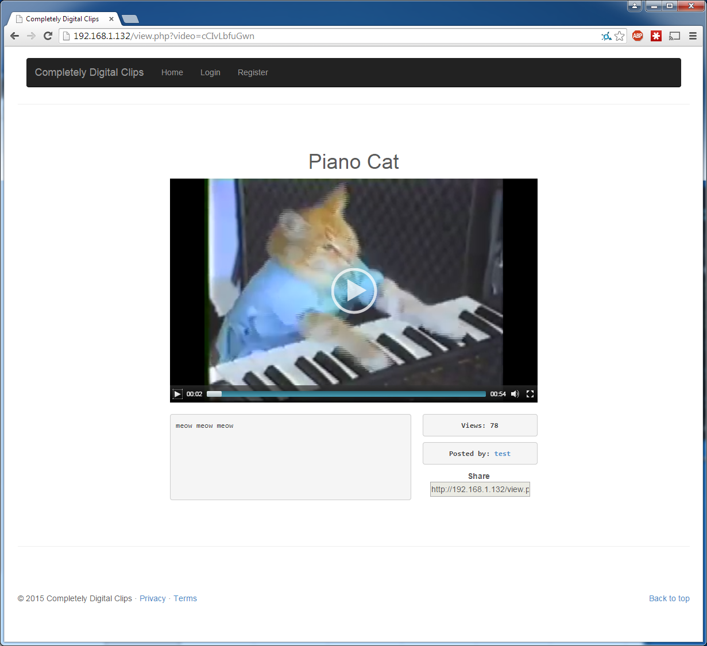
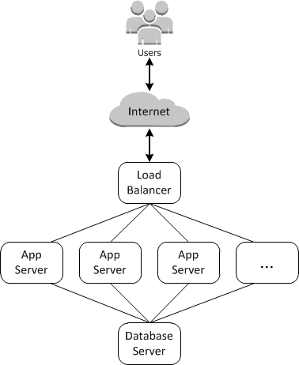

# Completely Digital Clips
A bad clone of YouTube in PHP for learning to hack.  This application is load balanced between one or more PHP applications relying on a single MySQL database.

This is an intentionally insecure web app!  It goes without saying that this should never be used in any sort of production environment.

On the Completely Digital Clips service, users will be able to upload, share, and view videos.  In the interests of privacy and security, users must login before they are able to upload videos or view private profile information.  Of the utmost importance is the ability to scale and grow with the increasing amounts of users.

To enable scalability a load balancer accepts and forwards requests to several different copies of the web service (running on machines called application servers).  The different copies of the web service all connect to the same backend database.

## Setup Database Server

Run `sudo apt-get update`

Run `sudo apt-get install mysql-server`

Edit `etc/mysql/my.cnf`

Set `bind-address = 0.0.0.0`

Run `sudo service mysql restart`

Checkout application source

Run `sudo apt-get install git`

Run `git clone https://github.com/benjholla/CompletelyDigitalClips.git`

Run database deployment script

`cd CompletelyDigitalClips`

`./create_application_database.sh`

To optionally [install phpMyAdmin](https://www.digitalocean.com/community/tutorials/how-to-install-and-secure-phpmyadmin-on-ubuntu-12-04) perform the following:

Run `sudo apt-get install apache2`

Run `sudo apt-get install php5 libapache2-mod-php5 php5-mcrypt php5-mysql libapache2-mod-auth-mysql`

Run `sudo apt-get install phpmyadmin apache2-utils`

Edit `/etc/apache2/apache2.conf`

Add `Include /etc/phpmyadmin/apache.conf` at the end of the file.

Run `sudo service apache2 restart`

Check that you can access [http://localhost/phpmyadmin](http://localhost/phpmyadmin).

## Setup Application Servers

For each application server perform the following:

Run `sudo apt-get update`

Run `sudo apt-get install git`

Run `sudo apt-get install apache2`

Run `sudo apt-get install php5 libapache2-mod-php5 php5-mcrypt php5-mysql libapache2-mod-auth-mysql`

Edit `/etc/php5/apache2/php.ini`

Set `file_uploads = On`

Set `upload_max_filesize = 100M`

Set `post_max_size = 100M`

Run `sudo service apache2 restart`

Checkout application source

`git clone https://github.com/benjholla/CompletelyDigitalClips.git`

Run application deployment script

`cd CompletelyDigitalClips`

`./deploy_application_server.sh`

## Setup Load Balancer

The load balancer is powered by [HAProxy](https://www.digitalocean.com/community/tutorials/how-to-use-haproxy-to-set-up-http-load-balancing-on-an-ubuntu-vps).

Run `sudo apt-get update`

Run `sudo apt-get install haproxy`

Edit `/etc/default/haproxy`

Set `ENABLED=1`

Run `sudo mv /etc/haproxy/haproxy.cfg{,.original}`

Create `/etc/haproxy/haproxy.cfg`

Add the following (replacing the IP addresses with the correct IPs of your machines):

	global
	    log 127.0.0.1 local0 notice
	    maxconn 2000
	    user haproxy
	    group haproxy
	
	defaults
	    log     global
	    mode    http
	    option  httplog
	    option  dontlognull
	    retries 3
	    option redispatch
	    timeout connect  5000
	    timeout client  10000
	    timeout server  10000
	
	listen video_servers 0.0.0.0:80
	    stats enable
	    stats uri /stats
	    balance roundrobin
	    option httpclose
	    option forwardfor
	    server video1 192.168.1.76:80 check
	    server video2 192.168.1.21:80 check
	
	listen database 0.0.0.0:8080
	    stats enable
	    stats uri /stats
	    balance roundrobin
	    option httpclose
	    option forwardfor
	    server database 192.168.1.105:80 check

Run `sudo service haproxy start` or `sudo service haproxy restart`
